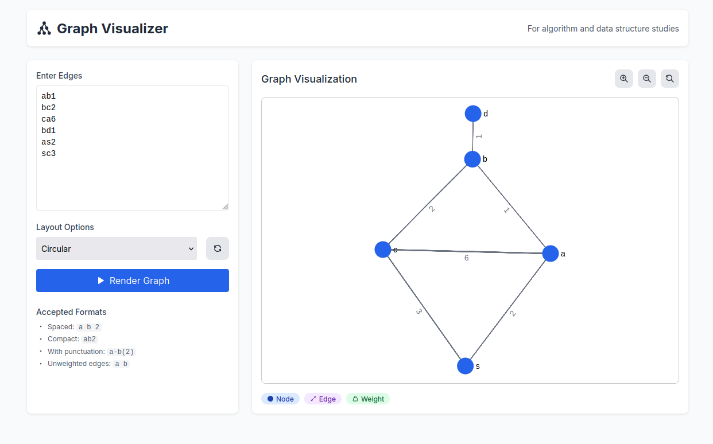
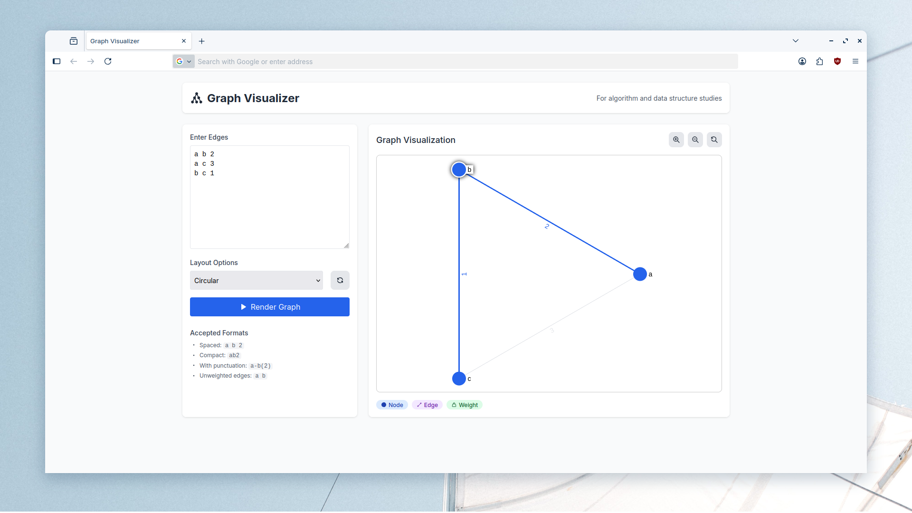
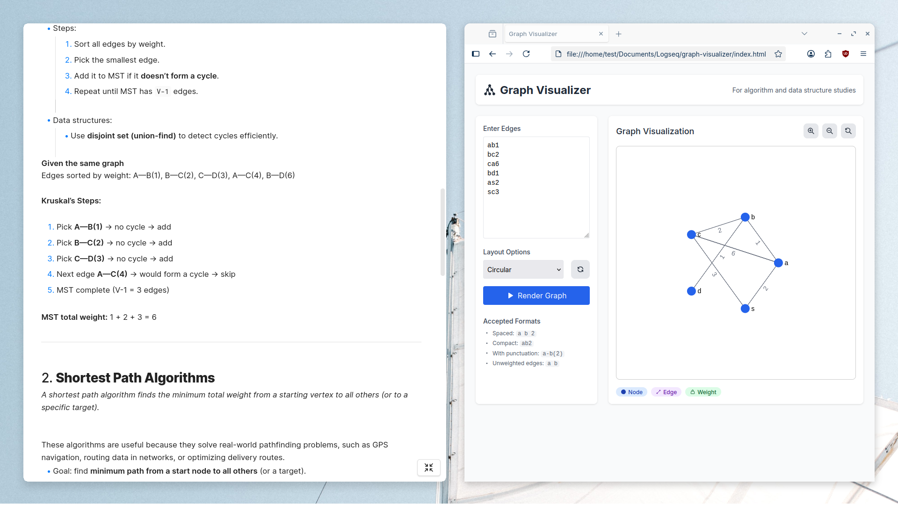
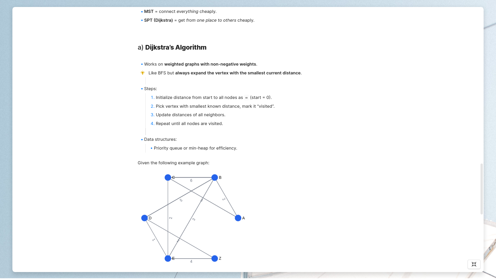
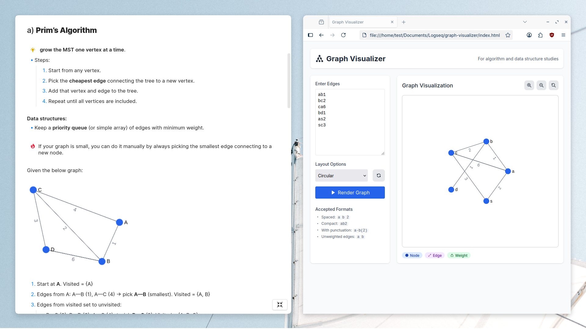

# Graph Visualizer 🗺️

[](https://opensource.org/licenses/MIT)
[](http://makeapullrequest.com)

A lightweight, browser-based graph visualizer designed to help students and developers visualize graphs and practice graph algorithms. Perfect for algorithm studies and note-taking in tools like Obsidian.

## ✨ Features

- **Simple Input Format**: Input graphs using the format `A-B 2` (Node1-Node2 Weight)
- **Export Options**: Save graph as PNG for your notes or presentations
- **No Dependencies**: Pure HTML, CSS, and JavaScript - runs directly in your browser
- **Responsive Design**: Works on both desktop and mobile devices

## 🚀 Motivation

When I was studying algorithms and data structures as a course in university, I often found myself needing to visualize graphs from my studies. When practicing with AI tools like ChatGPT, I'd receive graph definitions in formats like `A-B 2` (representing an edge between node A and B with weight 2), but had to draw them manually to visualize them properly.

This tool was born out of that need - a simple, no-frills way to quickly visualize graphs without leaving the browser.

## 🖥️ Usage

### 🌐 Recommended (Online)
The easiest way is to use the live version—no setup required:

👉 [**Open Graph Visualizer**](https://tomcegraphics.github.io/graph-visualizer/)

---

### 💻 Offline (Local Setup)
If you prefer running it locally:

1. **Clone the repo**
   ```bash
   git clone https://github.com/tomcegraphics/graph-visualizer.git
   cd graph-visualizer

2. **Open the app**
   - Simply double-click `index.html`
   - Or serve it locally for a smoother dev experience:

   ```bash
   python -m http.server
   ```

   Then visit: http://localhost:8000


## 📸 Examples in Obsidian

### Graph Visualization



### With Algorithm Notes





## 🛠️ Development

This is a simple, self-contained project with no build step required.

To contribute or modify:
1. Fork the repository
2. Make your changes
3. Open a pull request

## 📝 License

This project is licensed under the MIT License - see the [LICENSE](LICENSE) file for details.

## 🙏 Acknowledgments

- Built with [Sigma.js](https://github.com/jacomyal/sigma.js) for graph visualization
- Inspired by countless algorithm study sessions
- Special thanks to the open source community for amazing tools and resources
